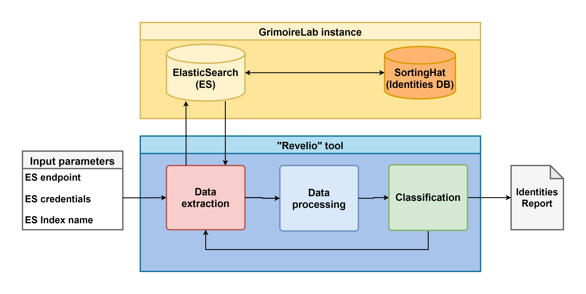

# Revelio: Bot classifier integrable with GrimoireLab

The aim of this tool is to detect Bots automatically based on their profiles' information and their activity in the project, integrable as a component inside the [GrimoireLab](https://github.com/chaoss/grimoirelab) toolchain. To develop  the first version of this tool, we analyzed the code changes from a set of software projects from the Wikimedia Foundation, produced between January 2008 and September 2021 using GrimoireLab, labeling manually the Bot accounts generating activity with the purpose of creating an input dataset to train a binary classifier to detect whether a given profile is a Bot or not.


## General architecture



The tool requires a running GrimoireLab instance to execute. This GrimoireLab instance would contain data from many endpoints stored in an ElasticSearch instance, together with a relational database containing identity information.

With the GrimoireLab instance in place, Revelio accepts three main input parameters:
* The URL or the IP address of the ElasticSearch instance.
* The credentials to access ElasticSearch and SortingHat.
* The index name from ElasticSeach, containing the GrimoreLab-formatted data.

With these input parameters, the tool executes the following steps:

### Data extraction

Revelio extracts the data per individual from the selected index querying the ElasticSearch instance (`ES-extract-datasets.py`).

### Data processing

The extracted data is analyzed and processed, creating the datasets for the classification phase (`build-classifier-input.py`, `exploratory-data-analysis.ipynb`).

### Classification

In this phase, the classification models are defined and adjusted. The output of this chain is a report containing the results of the classification: A boolean attribute for each individual indicating if it is a bot or not, and another attribute for the accuracy of the result (`classifiers.ipynb`).

## How to execute

Install the requirements using python-pip:

```bash
$ pip3 install -r requirements.txt
```

Get the GrimoireLab instance up and running:

```bash
$ cd docker-compose
$ docker-compose up -d
```

To extract the data from ElasticSearch, run:

```bash
$ python3 revelio/ES-extract-datasets.py
```

This script generates one JSON file per unique individual found in the data obtained by GrimoreLab in the directory `data`.

Then, the script `build-classifier-input.py` will load each file in the `data` directory to build the input dataset for the classification stage. Then, this dataset is exported into a file inside the `datasets` directory.

```bash
$ python3 revelio/build-classifier-input.py
```

Note: The resulting datasets are not published because they contain personal information (names and emails). To ease future analysis, we are sharing the accounts marked as bots, as they are not subject to the GDPR.

To execute the Notebooks, we need to start Jupyter:

```bash
$ jupyter notebook
```

By default, the Jupyter interface is available at http://localhost:8888. There, we can execute both notebooks: `exploratory-data-analysis.ipynb` and `classifier.ipynb`.
